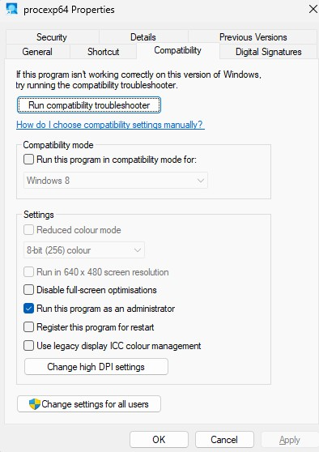
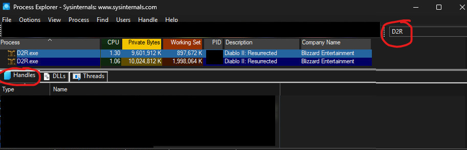
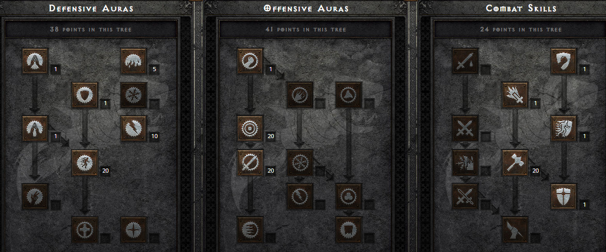
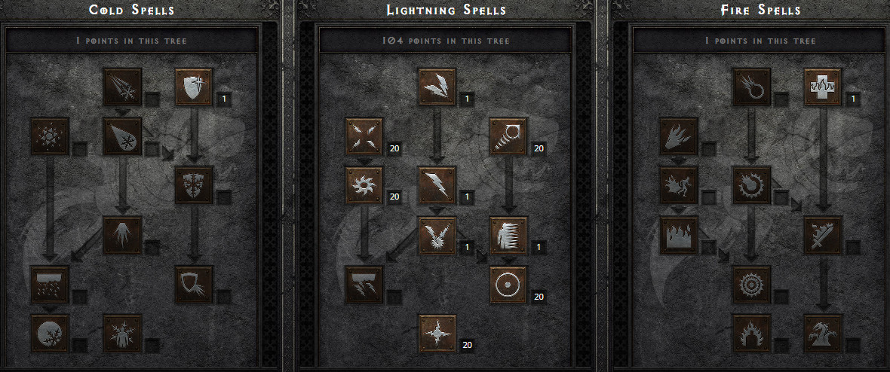

# About

I enjoy playing Diablo II Resurrected on occasion, but since I take long breaks between play sessions, I often forget some mechanics. To help with that, I created a guide for myself. It's mostly aimed at ladder hardcore play.

# Table of Contents

[TOC]

# Common abbreviations

| Abbreviation | Full Form                                                    |
| ------------ | ------------------------------------------------------------ |
| Anni         | [Annihilus Charm](https://diablo.fandom.com/wiki/Annihilus)  |
| BO           | [Battle Orders](https://diablo.fandom.com/wiki/Battle_Orders) |
| BC           | [Battle Command](https://diablo.fandom.com/wiki/Battle_Command) |
| CTA          | [Call to Arms](https://diablo.fandom.com/wiki/Call_to_Arms_Rune_Word) |
| D2R          | Diablo 2: Resurrected                                        |
| ES           | [Energy Shield](https://diablo.fandom.com/wiki/Energy_Shield) |
| Eth          | [Ethereal](https://diablo.fandom.com/wiki/Ethereal_Items)    |
| Hoto         | [Heart of the Oak](https://diablo.fandom.com/wiki/Heart_of_the_Oak_Rune_Word) |
| SoJ          | [Stone of Jordan](https://diablo.fandom.com/wiki/Stone_of_Jordan_(Diablo_II)) |
| Torch        | [Hellfire Torch](https://diablo.fandom.com/wiki/Hellfire_Torch) |

# Where to level (online play)

| Character Level | Best Leveling Area                                           |
| --------------- | ------------------------------------------------------------ |
| 1-15            | [Tristram](https://diablo-archive.fandom.com/wiki/Tristram_(Diablo_II)) (Act 1, Stony Field, requires completed [Cain quest](https://diablo.fandom.com/wiki/Search_for_Cain_(Quest))) |
| 15-24           | Tombs (Act 2, [Canyon of the Magi](https://diablo.fandom.com/wiki/Canyon_of_the_Magi)) |
| 24              | Ancients                                                     |
| 25-40           | Baal runs (Act 5, [Throne of Destruction](https://diablo.fandom.com/wiki/Throne_of_Destruction)) |
| 40              | Nightmare Ancients                                           |
| 41-60           | Nightmare Baal runs (Act 5, [Throne of Destruction](https://diablo.fandom.com/wiki/Throne_of_Destruction)) |
| 60              | Hell Ancients                                                |
| 61-94           | Hell Baal runs (Act 5, [Throne of Destruction](https://diablo.fandom.com/wiki/Throne_of_Destruction)) |
| 95+             | [Terror zones](https://diablo.fandom.com/wiki/Terror_Zone) (target elites and big packs) |

*It's generally recommended for hardcore characters to overlevel before entering the next difficulty.*

# General tips and info

- The [Monarch](https://diablo.fandom.com/wiki/Monarch) is the lowest-strength shield capable of having 4 sockets.
- To get a 1-3 socket shield go to Normal Act 2. Be alone in the act and check Fara's stock. Reroll it by leaving town or entering the sewers until you get the sockets you need (note that the items themselves won't reroll, only their stats, including sockets). A 3-socket shield usually appears within three minutes.
- You can use multiple accounts simultaneously for trading, waypoints, rushing and for applying battle orders. See [here](#Run 2 (or more) Diablo II Resurrected instances simultaneously). 
- "Damage is transferred to mana" and Energy Shield interact as follows: only the damage that affects your health pool is converted to mana.
- Max block cap is: 75% and scales with shield block chance, Dexterity and a few items/skills.
- Damage reduction (physical) cap is 50%.
- Resistance hard-cap is 95% for players.
- Elemental absorb applies after resistances, reduces the damage and if you survive it, it heals you for the prevented damage amount.
- Elemental damage is first reduced by resistance, then absorb is applied. I.e. if you take 1000 cold damage with 95% resistance and 20% absorb, resistance reduces the damage to 50. Then absorb reduces it down to 40 damage. You then take 40 damage, and **after** that, you heal for 10. Yes, you could die before the healing procs.
- Poison resistance also decreases the poison duration and negative poison resistance increases its duration.
- Sundering an enemy lowers its resistance to 95%, without affecting party members or your mercenary. [Lower Resist](https://diablo.fandom.com/wiki/Lower_Resist), [Conviction](https://diablo.fandom.com/wiki/Conviction) (including the one from items such as [Infinity](https://diablo.fandom.com/wiki/Infinity_Rune_Word)), and [Cold Mastery](https://diablo.fandom.com/wiki/Cold_Mastery) are only 1/5th effective on sundered monsters, while other sources remain fully effective. A monster's resistances are capped between 100% and -100%.
- [Energy Shield](https://diablo.fandom.com/wiki/Energy_Shield) does not reduce damage through resistances, physical damage reduction, etc. It also does not protect against poison damage.
- Infinite respecs using [Token of Absolution](https://diablo-archive.fandom.com/wiki/Token_of_Absolution_(Diablo_II)). They are obtained from Andariel or Duriel, Mephisto, Diablo and Baal. Each boss has a ~10% drop chance when solo and caps at 33% in a party of 3+.
- The monster level determines the minimum item level. I.e. an monster level of 50 means that any items dropped by that monster (including from the [Find Item](https://diablo.fandom.com/wiki/Find_Item) skill) are at least item level 50.
- You may want to reset your stat points in late-game because some unique charms and items may give you a lot of +Strength, +Dexterity and block chance. I.e. the Paladin may only need about 100 base Strength and 100 base Dexterity, the rest can go into Vitality.
- Magic Find has [strong diminishing returns](https://diablo-archive.fandom.com/wiki/Magic_Find_(Diablo_II)). Aim for about 100 magic find if you have room for it.

# Hardcore specific tips

- Cap fire, lightning, and cold resistances; poison resistance is only for quality of life.
- Overlevel before entering the next difficulty.
- Use a [CTA](https://diablo.fandom.com/wiki/Call_to_Arms_Rune_Word) or better, Barbarian shouts for squishy classes like the Sorceress. [Nature's Peace](https://diablo.fandom.com/wiki/Nature%27s_Peace) is also an option but the summon is often killed on higher difficulties, removing your buff instantly. You can also [run multiple instances](#Run 2 (or more) Diablo II Resurrected instances simultaneously) to [Battle Order](https://diablo.fandom.com/wiki/Battle_Orders) yourself.
- Socket an [Um rune](https://diablo.fandom.com/wiki/Um_Rune) into helmet and/or body armor for more resists if needed.
- Leveling runewords:
  - [Ancient's Pledge](https://diablo.fandom.com/wiki/Ancient%27s_Pledge_Rune_Word)
  - [Edge](https://diablo.fandom.com/wiki/Edge_Rune_Word) (For summoners (thorns aura) and to reduce vendor prices by 15%)
  - [Leaf](https://diablo.fandom.com/wiki/Leaf_Rune_Word) (Fire Sorceress only)
  - [Lore](https://diablo.fandom.com/wiki/Lore_Rune_Word)
  - [Insight](https://diablo.fandom.com/wiki/Insight_Rune_Word) (Act 2 mercenary only, provides a lot of mana regen but requires 4 sockets)
  - [Pattern](https://diablo.fandom.com/wiki/Pattern_Rune_Word) (Melee Assassin only)
  - [Smoke](https://diablo.fandom.com/wiki/Smoke_Rune_Word)
- [Crown of Ages](https://diablo.fandom.com/wiki/Crown_of_Ages) with 2 socketed [Sol runes](https://diablo.fandom.com/wiki/Sol_Rune) (or the very expensive option: 2 [Ber runes](https://diablo.fandom.com/wiki/Ber_Rune)) is a viable hardcore option
- Recommended ladder starting classes: Paladin (or Javazon cows) to farm items for your other classes. Fishymancer (Necromancer) is the safest one for beginners but he is not great at farming in late-game. Don't pick Sorceress because she needs a lot of investment to be both safe and viable in hardcore. Paladin is the safest choice for intermediate players and his gear is relatively cheap to obtain through trade.
- You must enable corpse looting for your second account or friends before you die, or they won't be able to loot your body after you died. Only equipped items may be looted, the inventory contents cannot.
- A [Guardian Angel](https://diablo.fandom.com/wiki/Guardian_Angel) is the safest reasonably obtainable armor in online play.

# Most dangerous enemies in hardcore

## [Dolls](https://diablo.fandom.com/wiki/Bone_Fetish)

Dolls explode when killed, dealing physical damage that does not scale with any modifiers the doll may have had while alive, nor with any auras. They are even more dangerous when you are cursed with [Amplify Damage](https://diablo.fandom.com/wiki/Amplify_Damage) or [Decrepify](https://diablo.fandom.com/wiki/Decrepify). The explosion damage can be blocked.

[Mercenaries](https://diablo.fandom.com/wiki/Mercenaries) are immune to the explosion.

## [Shamans](https://diablo.fandom.com/wiki/Fetish_Shaman) 

Their fire attack is dangerous, especially in normal difficulty for squishy classes if you are not fire resistance (over-)capped yet.

## [Willowisps](https://diablo.fandom.com/wiki/Willowisp)

Also known as Souls or Ghosts, the most dangerous enemy by far. Their damage can suddenly spike even with max lightning resist and some also burn mana which is bad for [ES](https://diablo.fandom.com/wiki/Energy_Shield) builds. It's not confirmed nor denied: they also deal physical damage with their lightning spell (this is a bug).

On Monster level 83, they deal 213-467 damage (42-108 of that is physical) per hit and you can get hit up to 5 times by a single spell for a total of 1065-2335 damage (pre damage reduction) from just one [Willowisp](https://diablo.fandom.com/wiki/Willowisp). With 75% lightning resistance and 30% physical damage reduction, you would still take a maximum of 1399 damage from a single spell with maximum hits. Using a [Wisp Projector](https://diablo.fandom.com/wiki/Wisp_Projector) only heals back about 118 damage out of the 1399 and if the 1399 would kill you, you would still be dead. A [Guardian Angel](https://diablo.fandom.com/wiki/Guardian_Angel) would reduce the total damage down to 1049. However, it's extremely unlikely that you get hit that badly 5x by a single spell.

A [Thundergod's Vigor](https://diablo.fandom.com/wiki/Thundergod%27s_Vigor_(Diablo_II)) helps a lot as well.

It's generally advised to over cap your Lightning resistance by about 85% to counter Willowisps that possess a [Conviction aura](https://diablo.fandom.com/wiki/Conviction) in hardcore. [Champions](https://www.purediablo.com/diablo-2/monster-modifiers#Champions), and the [Extra Strong](https://www.purediablo.com/diablo-2/monster-modifiers#Extra_Strong) modifier or other damage modifiers can be extremely dangerous.

## [Vipers](https://diablo.fandom.com/wiki/Claw_Viper)

Their charge attack is slightly dangerous.

# Run 2 (or more) Diablo II Resurrected instances simultaneously

*Note: administrator access and two Diablo II Resurrected keys (in good standing and **without 2FA**) on different accounts are required.*

## One-time configuration

1. Copy-paste your entire Diablo || Resurrected folder so that you now have two. Example:
   1. `D:\Blizzard\Diablo II Resurrected`
   2. `D:\Blizzard\Diablo II Resurrected_2`
2. Optionally (recommended):
   1. Create a shortcut to both `Diablo II Resurrected Launcher.exe` files (located in your `Diablo II Resurrected` game folders) and place them onto your desktop for easier access.
3. Download and install `Process Explorer` (don't worry, it's from Microsoft) from [here](https://learn.microsoft.com/en-us/sysinternals/downloads/process-explorer#download).
   1. Right click the `Process Explorer` > `Compatibility` and check `Run this program as an administrator`. 

## Steps required each time

1. Start 1 launcher and login into the game (start the game in the launcher as well!).
2. Start `Process Explorer`.
   1. Filter by name: `D2R`
      
   2. Click on your D2R.exe
   3. Click on `Handles`. If you don't see that window then make it visible through: `View > Show Lower Pane`.
   4. Find the `Event` that ends with `DiabloII Check For Other Instances`, right click it and select `Close Handle`.
   5. Launch the second launcher and login into the game.

# Act II Mercenary

## Weapons

- [Infinity](https://diablo.fandom.com/wiki/Infinity_Rune_Word)
- [Insight](https://diablo.fandom.com/wiki/Insight_Rune_Word)
- [Pride](https://diablo.fandom.com/wiki/Pride_Rune_Word) (for physical damage builds)

## Helmets

- [Cure](https://diablo.fandom.com/wiki/Cure_Rune_Word)
- [Andariel's Visage](https://diablo.fandom.com/wiki/Andariel%27s_Visage_(Diablo_II))
- [Tal Rasha's Horadric Crest](https://diablo.fandom.com/wiki/Tal_Rasha%27s_Horadric_Crest) (use for life leech if your mercenary has trouble surviving)

## Body armours

- [Chains of Honor](https://diablo.fandom.com/wiki/Chains_of_Honor_Rune_Word) (expensive option! Use this for life leech if you use [Cure](https://diablo.fandom.com/wiki/Cure_Rune_Word))
- [Fortitude](https://diablo.fandom.com/wiki/Fortitude_Rune_Word)
- [Guardian Angel](https://diablo.fandom.com/wiki/Guardian_Angel) (cheap but not best in slot)
- [Shaftstop](https://diablo.fandom.com/wiki/Shaftstop) (cheap but not best in slot)

## Mercenary tips

- General recommended mercenary type: [Holy Freeze](https://diablo.fandom.com/wiki/Holy_Freeze).
- A higher damage weapon means that your mercenary is able to leech (if it has any) more life.
- Prefer [Ethereal items](https://diablo.fandom.com/wiki/Ethereal_Items) for your mercenaries because item durability never decays on a mercenary.
- [Magic Find](https://diablo-archive.fandom.com/wiki/Magic_Find_(Diablo_II)) works on a mercenary as long as it delivers the killing blow.
- He can still be 'bugged' in Diablo II Resurrected using the Inner Cloister (YouTube it) to make all melee enemies ignore him, which is nice for cows.

# Classes

## Barbarian

### Pure shout support (no stun)

#### Skills

- Max out the following skills in order of priority: **Battle Orders**, **Shout**, **Battle Command**.
- Put 1 point into: **Increased Stamina**, **Increased Speed**, **Iron Skin**, **Leap**.
- Put however many points you need into: **Natural Resistances**.
- Optionally: put any left-over points into **Find Item**.

#### Gear

| Slot    | Item                                                         | Bonus                              |
| ------- | ------------------------------------------------------------ | ---------------------------------- |
| Weapons | 2x one-handed spear with +3 Warcries (can sometimes be bought from Anya in Hell difficulty, they are rather common). | +2-6 Battle Orders                 |
| Helmet  | [Halaberd’s Reign](https://diablo.fandom.com/wiki/Halaberd%27s_Reign). | +1-2 Battle Orders, +2 Barb Skills |
| Amulet  | +3 Barbarian Skills Amulet.                                  | +3 Barbarian Skills                |
| Armor   | [Enigma](https://diablo.fandom.com/wiki/Enigma_Rune_Word) (`Jah Ith Ber`) or [Arkaine's Valor.](https://diablo.fandom.com/wiki/Arkaine%27s_Valor_(Diablo_II)) | +2 All Skills                      |
| Belt    | [Arachnid Mesh.](https://diablo.fandom.com/wiki/Arachnid_Mesh) | +1 All Skills                      |
| Rings   | 2x [Bul-Kathos' Wedding Band](https://diablo.fandom.com/wiki/Bul-Kathos%27_Wedding_Band) or 2x [Stone of Jordan](https://diablo.fandom.com/wiki/Stone_of_Jordan_(Diablo_II)). | +1 All Skills each (+2 total)      |
| Gloves  | Whatever you want, *no skills boost possible.*               | -                                  |
| Boots   | Whatever you want, *no skills boost possible.*               | -                                  |
| Charms  | [Annihilus](https://diablo.fandom.com/wiki/Annihilus).       | +1 All Skills                      |
|         | Barbarian [Hellfire Torch.](https://diablo.fandom.com/wiki/Hellfire_Torch) | +3 Barbarian Skills                |
|         | 9x [Sounding Grand Charm](https://diablo.fandom.com/wiki/Sounding) (Barbarian warcry Grand Charm). | +9 Barbarian Skills                |
|         | [Battle Command](https://diablo.fandom.com/wiki/Battle_Command) (cast [Battle Command](https://diablo.fandom.com/wiki/Battle_Command) before [Battle Orders](https://diablo.fandom.com/wiki/Battle_Orders)). | + 1 Barbarian Skills               |

All of that, max-rolled, should give you level 55 battle orders. Level 55 Battle Orders grants +147% Life/Mana/Stamina.

## Paladin

### Hammerdin

An extremely safe build with 90-95% resist, 45% damage reduction, 75% block and high damage, 100% Magic Find, ~1500 base defense, room for 2x 20% elemental absorb of your choice, can easily kill even solo Baal in a 8-player-game (so strong he doesn't even need skiller charms) and it's a relatively cheap build. Sadly, this build can't teleport and can do absolutely nothing against [Magic Imunes](https://diablo-archive.fandom.com/wiki/Immune_Monsters_(Diablo_II)#Magic_3) but there aren't that many.

You can be pretty much immune to elemental damage if you want. You can get 95% resist and on top of it you can get 20% absorb using rings up to 2 elements. A 2000 hit only hits you for (including heal from absorb) 60 damage and you probably have around 4000hp after [Battle Orders](https://diablo.fandom.com/wiki/Battle_Orders) and charms (excluding [Oak Sage](https://diablo.fandom.com/wiki/Oak_Sage)). Only physical damage can kill you but even that is very though due to the 75% block and 45% damage reduction.

Only dolls (and only if you are extremely unlucky with mods and blocking) could in theory kill you.

#### Skills

Skill priority

1. [Blessed Hammer](https://diablo.fandom.com/wiki/Blessed_Hammer)
2. [Holy Shield](https://diablo.fandom.com/wiki/Holy_Shield) (1 point)
3. [Concentration](https://diablo.fandom.com/wiki/Concentration)
4. [Vigor](https://diablo.fandom.com/wiki/Vigor)
5. [Blessed Aim](https://diablo.fandom.com/wiki/Blessed_Aim)
6. Optional: 1 point into [Salvation](https://diablo.fandom.com/wiki/Salvation) if needed if you have bad gear.
7. Remaining points either in [Resist Fire](https://diablo.fandom.com/wiki/Resist_Fire)/[Cold](https://diablo.fandom.com/wiki/Resist_Cold)/[Lightning](https://diablo.fandom.com/wiki/Resist_Lightning) for the passive bonus to get 95% resist. Prioritize lightning and fire first.

#### Stats

| Attribute (base-value) | Recommended                                                  |
| ---------------------- | ------------------------------------------------------------ |
| Strength               | About 115 - 156 strength, depending on [Annihilus](https://diablo.fandom.com/wiki/Annihilus), [Torch](https://diablo.fandom.com/wiki/Hellfire_Torch), other gear and charms because [Stormshield](https://diablo.fandom.com/wiki/Stormshield_(Diablo_II)) requires 156 Strength. |
| Dexterity              | About 80, depending on [Annihilus](https://diablo.fandom.com/wiki/Annihilus), [Torch](https://diablo.fandom.com/wiki/Hellfire_Torch), other gear and charms to obtain 75% block chance after applying [Holy Shield](https://diablo.fandom.com/wiki/Holy_Shield). |
| Vitality               | Everything else.                                             |
| Energy                 | Nothing.                                                     |

#### Gear

| Slot            | Item                                                         |
| --------------- | ------------------------------------------------------------ |
| **Helmet**      | [Harlequin Crest (a.k.a. Shako)](https://diablo.fandom.com/wiki/Harlequin_Crest_(Diablo_II)) |
| **Armor**       | [Guardian Angel](https://diablo.fandom.com/wiki/Guardian_Angel). |
| **Weapon**      | [Heart of the Oak (a.k.a. Hoto)](https://diablo.fandom.com/wiki/Heart_of_the_Oak_Rune_Word) or cheaper but less viable alternative: [Spirit](https://diablo.fandom.com/wiki/Spirit_Rune_Word). [Stormshield](https://diablo.fandom.com/wiki/Stormshield_(Diablo_II)) |
| **Gloves**      | [Magefist](https://diablo.fandom.com/wiki/Magefist_(Diablo_II)) |
| **Boots**       | Rare boots with life and movement speed (and resistance if needed). |
| **Belt**        | [Arachnid Mesh](https://diablo.fandom.com/wiki/Arachnid_Mesh) or cheaper version: a rare with lots of life that can sometimes be bought from Larzuk. |
| **Rings**       | 2 rings of choice except if you don't use [Arachnid Mesh](https://diablo.fandom.com/wiki/Arachnid_Mesh) because then you need 2 rings with 10 Faster Cast Rate each. Some example rings: [Stone of Jordan](https://diablo.fandom.com/wiki/Stone_of_Jordan_(Diablo_II)), [Bul-Kathos's Wedding Band](https://diablo.fandom.com/wiki/Bul-Kathos%27_Wedding_Band), [Dwarf Star](https://diablo.fandom.com/wiki/Dwarf_Star) (makes you almost immune to fire damage), [Raven Frost](https://diablo.fandom.com/wiki/Raven_Frost) (makes you almost immune to cold damage), [Wisp Projector ](https://diablo.fandom.com/wiki/Wisp_Projector)(20% absorb makes you almost immune to lightning damage), [Nature's Peace](https://diablo.fandom.com/wiki/Nature%27s_Peace) (no more enemy corpses). |
| **Amulet**      | [Mara's Kaleidoscope](https://diablo.fandom.com/wiki/Mara%27s_Kaleidoscope_(Diablo_II)) |
| **Weapon Swap** | [Call to Arms](https://diablo.fandom.com/wiki/Call_to_Arms_Rune_Word) (1 handed weapon, prioritize stat: Battle Orders). |
| **Charms**      | +Pala combat skills grand charms (ideally also with life or resist), [Annihilus](https://diablo.fandom.com/wiki/Annihilus), [Torch](https://diablo.fandom.com/wiki/Hellfire_Torch), Resist charms and life charms as needed. For the extra stat on charms (if any) prioritize Faster Run/Walk. |

Don't take [The Black Cleft](https://diablo.fandom.com/wiki/Black_Cleft), their magic resist will be 95 after breaking and there's no way to lower it further, if you must really kill them, use your mercenary.

Leveling Paladin level 15-24 is a bit painful unless you put points into melee and waste a reset. Do not level using [Holy Fire](https://diablo.fandom.com/wiki/Holy_Fire), it was [nerfed](https://news.blizzard.com/en-us/article/23788293/diablo-ii-resurrected-patch-2-4-ladder-now-live) really hard.

You can swap out [Guardian Angel](https://diablo.fandom.com/wiki/Guardian_Angel) for [Enigma](https://diablo.fandom.com/wiki/Enigma_Rune_Word) to gain teleport but it's expensive and then you should probably swap out the belt for [Thundergod's Vigor](https://diablo.fandom.com/wiki/Thundergod%27s_Vigor_(Diablo_II)) and use 2 rings with Faster Cast Rate to hit the 75 breakpoint.

As for items to socket into your gear, if you need resists then go [Um Rune](https://diablo.fandom.com/wiki/Um_Rune) or a cheap [Perfect Diamond](https://diablo.fandom.com/wiki/Diamond) into your shield. For body and helmet you should go with  2x [Ist Runes](https://diablo.fandom.com/wiki/Ist_Rune) to achieve a total of 100% Magic Find. You could add other runes to push your resists to 95% (I.e. [Ohm Rune](https://diablo.fandom.com/wiki/Ohm_Rune)) without using passive skills but it's honestly overkill even for hardcore. If you are extremely rich you could socket [Jah Runes](https://diablo.fandom.com/wiki/Jah_Rune) for the 2x 5%hp bonus.

In late-game, taking a Prayer Act 2 Mercenary is also a viable option since he heals back all the little damage you slowly take, thus, keeping your hp full and protecting you a bit from disconnects.

## Sorceress

### Lightning (Nova, Hardcore)

Be aware that any [Nova](https://diablo.fandom.com/wiki/Nova_(Diablo_II)) build is a really expensive and can relatively easy die in Hell difficulty. If you try to make her more tanky then you will lose too much offensive power.

#### Skills

1. Max [Nova](https://diablo.fandom.com/wiki/Nova_(Diablo_II)).
2. Max [Lightning Mastery](https://diablo.fandom.com/wiki/Lightning_Mastery).
3. *The other skills can be in any order as you prefer.*
4. Optional: a few points in [Warmth](https://diablo.fandom.com/wiki/Warmth) if you lack the gear to sustain mana and are unaffected by [Battle Orders](https://diablo.fandom.com/wiki/Battle_Orders).

#### Gear

| Slot            | Item                                                         |
| --------------- | ------------------------------------------------------------ |
| **Helmet**      | [Griffon's Eye](https://diablo.fandom.com/wiki/Griffon%27s_Eye) (socket: 5/5 Lightning Facet). Prioritize stat: **-To Enemy Lighting Resistance** |
| **Armor**       | [Vipermagi](https://diablo.fandom.com/wiki/Skin_of_the_Vipermagi) (socket: 5/5 Lightning Facet, prioritize stat: **All Resistances**) or [Guardian Angel](https://diablo.fandom.com/wiki/Guardian_Angel) |
| **Weapon**      | [Infinity](https://diablo.fandom.com/wiki/Infinity_Rune_Word) or cheaper alternative: [Crescent Moon](https://diablo.fandom.com/wiki/Crescent_Moon_Rune_Word) with a [StormShield](https://diablo.fandom.com/wiki/Stormshield_(Diablo_II)) (socket if you can afford: [Ber rune](https://diablo.fandom.com/wiki/Ber_Rune)) or the cheaper alternative: [Monarch Spirit shield](https://diablo.fandom.com/wiki/Spirit_Rune_Word) |
| **Gloves**      | [Magefist](https://diablo.fandom.com/wiki/Magefist_(Diablo_II)) (use [Frostburn](https://diablo.fandom.com/wiki/Frostburn_(Diablo_II)) instead if Energy Shield build) |
| **Boots**       | Rare boots with life and tri-res                             |
| **Belt**        | [Arachnid Mesh](https://diablo.fandom.com/wiki/Arachnid_Mesh) or cheaper version: a rare with lots of life that can sometimes be bought from Larzuk |
| **Rings**       | 2x [Bul-Kathos' Wedding Band](https://diablo.fandom.com/wiki/Bul-Kathos%27_Wedding_Band) |
| **Amulet**      | Crafted Sorceress amulet or cheaper alternative: [Mara's Kaleidoscope](https://diablo.fandom.com/wiki/Mara%27s_Kaleidoscope_(Diablo_II)) |
| **Weapon Swap** | [Call to Arms](https://diablo.fandom.com/wiki/Call_to_Arms_Rune_Word) (1 handed weapon, prioritize stat: Battle Orders) |
| **Charms**      | +Lightning Skills GC (ideally also with life or resist), [Annihilus](https://diablo.fandom.com/wiki/Annihilus), [Torch](https://diablo.fandom.com/wiki/Hellfire_Torch), [Crack of The Heavens](https://diablo.fandom.com/wiki/Crack_of_the_Heavens), Resist charms and life charms as needed |

It's recommended to use another Sorceress build until you can get enough lightning penetration items and a decent [Crack of The Heavens](https://diablo.fandom.com/wiki/Crack_of_the_Heavens). Either [Infinity](https://diablo.fandom.com/wiki/Infinity_Rune_Word) or a [Griffon's Eye](https://diablo.fandom.com/wiki/Griffon%27s_Eye) is pretty much a must in party play. If you prefer to play lightning anyway, then go with [Lightning](https://diablo.fandom.com/wiki/Lightning_(skill)) and [Chain Lightning](https://diablo.fandom.com/wiki/Chain_Lightning_(Diablo_II)) first and respec later but it's not recommended because Faster Cast Rate doesn't work on those 2 skills plus there are lots of lightning immunes in Hell, go fire/cold instead.

# Breakpoints by class

| Class                | Faster Cast Rate Breakpoints (in frames) | Faster Hit Recovery Breakpoints (in frames) | Block Rate Breakpoints (in %) |
| -------------------- | ---------------------------------------- | ------------------------------------------- | ---------------------------- |
| **Amazon**           | 0, 7, 14, 22, 32, 48, 68, 99, 152        | 0, 6, 13, 20, 32, 52, 86, 174, 600          | 0, 27, 48, 75                |
| **Assassin**         | 0, 8, 16, 27, 42, 65, 102, 174           | 0, 7, 15, 27, 48, 86, 200                   | 0, 27, 48, 75                |
| **Barbarian**        | 0, 9, 20, 37, 63, 105, 200 (for Warcry)  | 0, 7, 15, 27, 48, 86, 200                   | 0, 27, 48, 75                |
| **Druid (Human)**    | 0, 4, 10, 19, 30, 46, 63, 99, 163        | 0, 5, 10, 16, 26, 39, 56, 86, 152, 377      | 0, 27, 48, 75                |
| **Druid (Werewolf)** | 0, 6, 14, 26, 40, 60, 95                 | 0, 9, 20, 42, 86                            | 0, 27, 48, 75                |
| **Druid (Werebear)** | N/A                                      | 0, 5, 10, 16, 24, 37, 54, 86, 152, 360      | 0, 27, 48, 75                |
| **Necromancer**      | 0, 9, 18, 30, 48, 75, 125                | 0, 5, 10, 16, 26, 39, 56, 86, 152, 377      | 0, 27, 48, 75                |
| **Paladin**          | 0, 9, 18, 30, 48, 75, 125                | 0, 7, 15, 27, 48, 86, 200                   | 0, 27, 48, 75                |
| **Sorceress**        | 0, 9, 20, 37, 63, 105, 200               | 0, 5, 9, 14, 20, 30, 42, 60, 86, 142, 280   | 0, 27, 48, 75                |

# Valuable socket items (ladder only)

| Item Name                                                    | Sockets Needed | Common Uses / Runewords                                      | Min Item Level for Max Sockets (Larzuk) |
| ------------------------------------------------------------ | -------------- | ------------------------------------------------------------ | --------------------------------------- |
| Any one-handed white weapon                                  | 5              | [Call To Arms](https://diablo.fandom.com/wiki/Call_to_Arms_Rune_Word) | ?                                       |
| Archon Plate                                                 | 3 or 4         | [Chains of Honor](https://diablo.fandom.com/wiki/Chains_of_Honor_Rune_Word), [Enigma](https://diablo.fandom.com/wiki/Enigma_Rune_Word), [Fortitude](https://diablo.fandom.com/wiki/Fortitude_Rune_Word) | 40                                      |
| Colossus Voulge (eth and non-eth)                            | 4              | [Infinity](https://diablo.fandom.com/wiki/Infinity_Rune_Word), [Insight](https://diablo.fandom.com/wiki/Insight_Rune_Word) | 26                                      |
| Giant Thresher (eth)                                         | 4              | [Infinity](https://diablo.fandom.com/wiki/Infinity_Rune_Word), [Insight](https://diablo.fandom.com/wiki/Insight_Rune_Word) | 53                                      |
| Grand Matron Bow (GMB) with 15% enhanced damage and +3 skill | 4              | [Faith](https://diablo.fandom.com/wiki/Faith_Rune_Word)      | ?                                       |
| Greater Talons or Runic Talons with **+3 Phoenix Strike** and another useable one (or two) | 3              | [Mosaic](https://diablo.fandom.com/wiki/Mosaic_Rune_Word)    | 40                                      |
| Monarch                                                      | 4              | [Spirit](https://diablo.fandom.com/wiki/Spirit_Rune_Word)    | 40                                      |
| Phase Blade or Flail                                         | 5              | [Call to Arms](https://diablo.fandom.com/wiki/Call_to_Arms_Rune_Word) | 50                                      |
| Sacred Targe                                                 | 4              | [Spirit](https://diablo.fandom.com/wiki/Spirit_Rune_Word) (Paladin only) | 40 (for max sockets on Elite version)   |
| Thresher (eth and non-eth)                                   | 4              | [Infinity](https://diablo.fandom.com/wiki/Infinity_Rune_Word), [Insight](https://diablo.fandom.com/wiki/Insight_Rune_Word) | 53                                      |

# Larzuk sockets

| Item Type   | Sockets on item level 1-24 | Sockets on item level 25-39 | Sockets on item level 40+ | Max Sockets |
| ----------- | -------------------------- | --------------------------- | ------------------------- | ----------- |
| **Weapons** | 1-2                        | 3                           | 4-6                       | 4-6         |
| **Armor**   | 1-2                        | 3                           | 4                         | 4           |
| **Shields** | 1-2                        | 3                           | 4                         | 4           |

# Important quest completion criteria

## Den of Evil
You have to kill at least 1 monster yourself and be in the Den of Evil when the last monster is killed.

## Andariel
You must be in the same area (Catacombs Level 4), you don't have to be near her.

## Summoner
You must be close to get the kill. If you missed it, then you could still walk to it, open the tome and go into the red portal to get the waypoint. However, you cannot enter another person's town portal but you can run to her tomb from the waypoint.

## Duriel
Be in her tomb but you don't have to be in her chamber. If you don't complete the quest when she is killed then just go into her chamber and talk to the angel and the quest will advance again.

## Mephisto
You have to be in the same area (Durance of Hate Level 3).

## The Council
You need to smash the orb, you don't need the flail yourself but then a party member has to do to (not sure if you just need to be in the game, in Travincal or if you have to be close). If the quest doesn't complete that's okay, you can still enter the Durance of Hate Level 1 and you can also enter someone's portal to Mephisto.

## Diablo
You have to be close to Diablo when he is killed. There's a 'safe' spot where his fire usually doesn't hit you just a bit north of his initial spawning position.

## Baal
Be in his Worldstone Chamber. You may have to go back to the character select screen if you cannot start the next difficulty.

# Baal run (Hell) level chart

| Level        | Estimated Hell Baal runs required to level up |
| ------------ | --------------------------------------------- |
| 90 &rarr; 91 | 30                                            |
| 91 &rarr; 92 | 45                                            |
| 92 &rarr; 93 | 87                                            |
| 93 &rarr; 94 | 145                                           |
| 94 &rarr; 95 | 257                                           |
| 95 &rarr; 96 | 503                                           |
| 96 &rarr; 97 | 765                                           |
| 97 &rarr; 98 | 1628                                          |
| 98 &rarr; 99 | 4546                                          |

*Only applies to an 8-player party with all members being there. Does not take into account a possible [Experience Shrine](https://diablo.fandom.com/wiki/Shrines_(Diablo_II)), [Annihilus](https://diablo.fandom.com/wiki/Annihilus) or [Ondal's Wisdom](https://diablo.fandom.com/wiki/Ondal%27s_Wisdom), doesn't include Baal kill and doesn't include the run from Waypoint &rarr; Throne of Destruction.*
